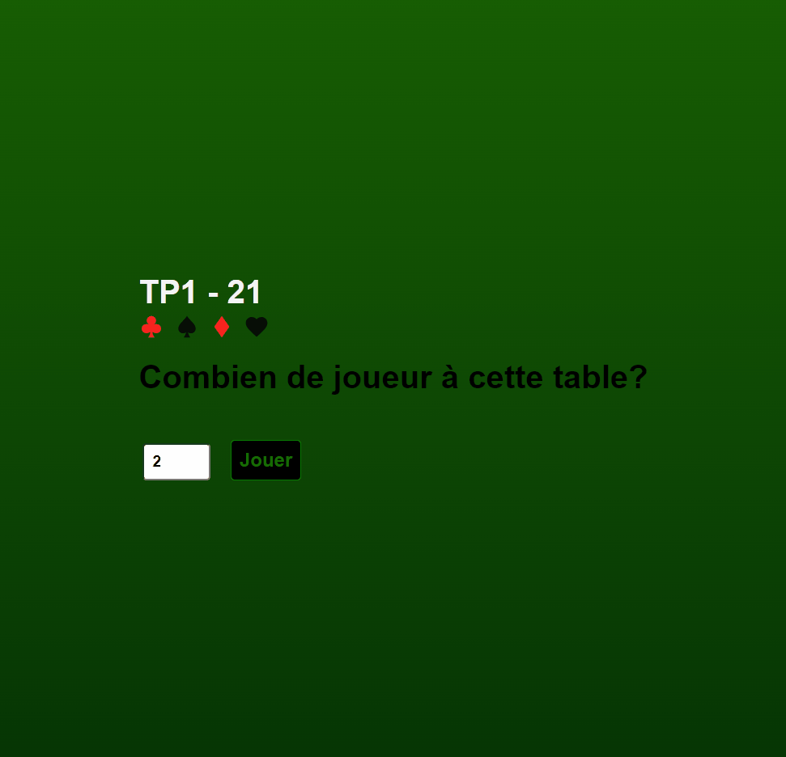

# BlackJack for the JS cours

Play here: https://blackjack-alana.netlify.app/

## Règles du jeu
### Le jeu qui vous est demandé de développer s’inspire du 21, en plus simple et sans argent. Au début de chaque partie, on demande à l’utilisateur combien de joueurs seront de la partie (champ number obligatoire). Une fois le chiffre saisi, on instancie ce nombre de joueurs. À tour de rôle, chaque joueur peut demander de recevoir une carte ou arrêter de jouer. Le ou les joueur(s) qui atteindra le plus près la valeur de 21 - sans dépasser - par l’addition de ses cartes gagnera la partie.

### La valeur des cartes se décline ainsi :

- as = 11
- 2 à 10 = leur valeur nominative
- figure = 10

### Un joueur qui dépasse 21 ne pourra plus jouer et un joueur qui stoppe son attribution de carte ne se verra plus offrir la possibilité de recevoir une nouvelle carte. Le jeu est terminé et  affiche le ou les gagnant(s) lorsque tous les joueurs ont fini de jouer, soit parce qu’ils ont dépassé 21 ou qu’ils ont confiance en leur main et stoppé leur partie. Évidemment, il n’y a pas de gagnant si tous les joueurs dépassent 21.
### À la fin de chaque partie un bouton ‘Rejouer’ sont  affichés. Le bouton ‘Rejouer’ permet de recommencer la partie sans rafraichir la page, le joueur peut alors saisir un nouveau nombre de joueurs dans le formulaire initial et jouer une nouvelle partie.

## Exigences techniques et critères d’évaluation
- Réussite des différentes fonctionnalités
- Utilisation de classe ES6 de type Module
- Absence de fonctions fléchées (arrow functions)
- Ergonomie générale : ce n’est pas un travail de CSS, mais les styles doivent offrir un comportement de jeu intuitif
- Structure du code
- Code sémantique
- Commentaires fréquents et pertinents
- Qualité des algorithmes et qualité du code source
- Le jeu est en ligne

